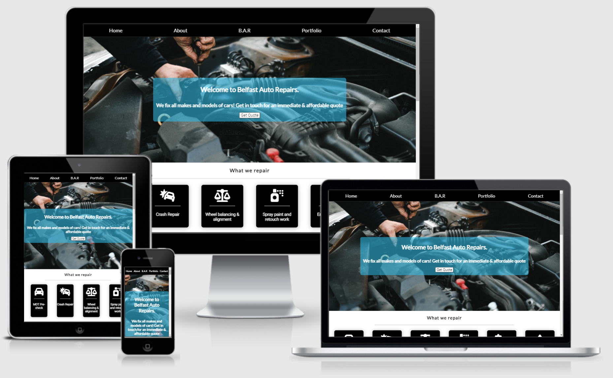
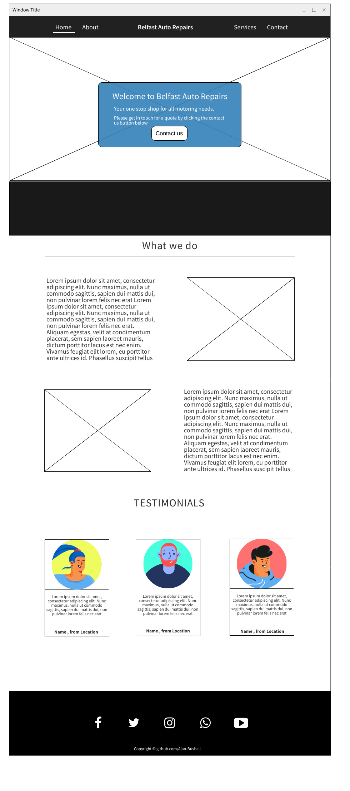
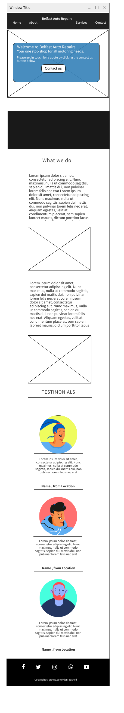

# Belfast Auto Repairs
## A website built for a fictional auto repair garage based out of Belfast, Northern Ireland.
### MS1 - Alan Bushell

**[Live site]()**

------------------------------------------------------------------

**[Repository]()**
  

## UX
### Pre-project Planning
>When deciding on this project I made a couple of point systems that ultimately lead me to this industry and the style at which I would try to create it.

I measured the following business types with a criteria out of 10 on a number of viable category's to determine what would be best to proceed.
A high score for portfolio would indicate more marketable when seeking future employment.
A high score for complexity would indicate a harder project but in turn also a good show of skill.
A high score for Time would indicate less time to actually create project.
A high score for Revenue Potential would indicate more potential work from servicing this market.

| Type | Portfolio-Weight | Complexity | Time to research | Revenue Potential| Total Score: |
| Services | 9 | 7 | 9 | 9 | 34 |
| Club | 8 | 7 | 8 | 8 | 31 |
| Small Biz | 9 | 7 | 8 | 0 | 33 |
| Specific Topic(historical or other) | 5 | 7 | 2 | 1 | 15 |

>From the above the best path forward & best for my growth would be to build a Service website.

At this stage I drilled down into the Service Industry and listed 8 different services provided and ranked them by 1 to 8, with 1 being the most interesting to me personally.

Here is how I established the ranking and also the options:
1. Accounting - 8
2. Personal Training - 3
3. Plumber / Boiler Servicing - 2
4. Mechanic / Automotive - 1
5. Cakes / Baking - 7
6. Entertainment ( Dj's, Bouncy Castles etc) - 6
7. Landscaping - 4
8. Painting & Decorating - 5

This above preplanning helped me to determine the type of project & industry to build for.

# UX design

## Strategy Plane

### To determine the best approach to this project I started with to determine the user and business needs.

## User Stories

### User
> As a user I want to be able to find a mechanic in my local area to fix my car.  
> As a user I want to be able to contact the merchant online.  
> As a user I want to be able to request a quote online.  
> As a user I want to be able to see evidence of the merchants work & read testimonials as proof of work.  
> As a user I want to be able to find out when the business is open.

### Business Owner
> As the site owner I want to be able to showcase my business to prospective customers.  
> As the site owner I want to build trust and showcase details of my family run business and work completed.  
> As the site owner I want to create leads and provide customers a way to book in and/or request quotes.  
> As the site owner I want to use this website to attract more business from customers in and around Belfast. 
> As the site owner I want to show the user my business opening hours.   

## Scope Plane
> The website should have a Navigation menu that is consistent across all pages and devices.  
> The website should have a welcome message for the user explaining to them who we are and what we do.  
> The website should neatly and appropriatly list the services we provide to the user.  
> The website should give the user proof of work completed through testimonials and/or a portoflio of work done or in progress.  
> The website should give the user a way to contact the business for quotes or consultations through a form.  
> The website should give the user more contact methods including phone number and the physical address.  
> The website should include a map so the user can plan their route to the business. 
> The website should include opening hours for the user to view on all pages. 

## Structure Plane
> To acheieve the goals of the above the website should include at least 4 pages consisting of:  Home, About, Portfolio, Contact.  

**Home Page**
> Navigation with links  
> Hero welcome message with call to action to take user to contact form.  
> Service card section showcasing the many things that we can repair.
> Testimonials showcasing reviews and work completed from users of this business.
> Footer section with opening hours of the business along with links to the businesses social media pages.

**About**
> The about page should show a picture of the business owner.  
> The about page should explain any relevant information about the business in text format.  

**Portfolio**
> The portfolio page should show images in an organised responsive fashion showing proof of work complete or in progress. 

**Contact**
> The contact page should have a contact form for the user to get in touch or request quote.  
> The form should collect contact details for the customer so that the merchant can contact them back.
> The form should include an option for the user to select if they want to receive promotional offers and merchant collect e-mail addresses.
> The contact page should include multiple forms or contact including phone, address and a map of the business location.

## Skeleton Plane

### Home Page Desktop Wireframe

### Home Page mobile wireframe

> The design flow in this website was meant to showcase a balanced minimal design that provided relevant information in a concise format on all devices.  
> As the project was created, the intial design did not provide the flow that was expected in the pre project stage. The project was then adapted to help with this during development.  
> The color theme was to be mainly using black and white for the base content with most additional color coming from overlays, images and as a background on the contact form.  

## Surface Plane

## Features Left to Implement

## Technologies Used

**
**HTML**
**CSS**

Required to style my HTML and images

**[Mockflow](https://mockflow.com/)**
 
**Font Awesome** Used to add icons to website

**GoogleFonts** Used to add specific fonts to website.

## Testing

**Testing phase 1**

**Testing Phase 2**

**Testing Phase 3**

## **Bugs**
> Issues with centering content on the hero overlay

> Parralax just did not help the flow of the page where I had orignally placed it. 

> Decided to improve the flow of the page that the parralax would be better between the two content sections.

> Original image just didnt fit the flow of the page nor the style of the page

> Font awesome social media icons showing as squares even though the script link is in the head and icon tags are correct.(fixed)

> Issue with footer content overlapping and not centering

> issue with services overlapping on mobile. (fixed, was targetting wrong element container)

>Contrast issue noted on lighthouse for the tag elements on the testimonials.(fixed, made colour darker and increased font size and weight).

> Images not in correct aspect ratio. (removed placeholder images and downloaded them in the size needed.)

## Deployment

## Credits

>hero: (https://www.pexels.com/photo/an-auto-mechanic-checking-the-engine-of-a-car-4315570/)
>parralax: Photo by jae park from Pexels

> card1: Photo by Mike from Pexels(https://www.pexels.com/photo/white-land-rover-range-rover-suv-on-road-116675/)
> card1-user: Photo by Daniel Xavier from Pexels(https://www.pexels.com/photo/woman-wearing-black-eyeglasses-1239291/)

> card2: Photo by Lloyd Freeman from Pexels(https://www.pexels.com/photo/photo-of-mercedes-benz-g-class-parked-on-dirt-road-1429775/)
> card2-user: Photo by Andrea Piacquadio from Pexels(https://www.pexels.com/photo/man-in-brown-button-up-shirt-3785079/)

> card3: Photo by Mike from Pexels(https://www.pexels.com/photo/blue-bmw-coupe-892522/)
> card3-user: Photo by Nicholas Swatz from Pexels(https://www.pexels.com/photo/photo-of-man-wearing-white-shirt-2770600/)

> about-hero: Photo by Andrea Piacquadio from Pexels(https://www.pexels.com/photo/happy-elderly-worker-smiling-in-workshop-3846508/)

> port-image1: Photo by Andrea Piacquadio from Pexels(https://www.pexels.com/photo/man-in-black-jacket-standing-under-the-vehicle-3807133/)
> port-image2: Photo by Lex Ger from Pexels(https://www.pexels.com/photo/close-up-photo-of-automotive-part-3642618/)
> port-image3: Photo by Andrea Piacquadio from Pexels(https://www.pexels.com/photo/bearded-man-fixing-motorcycle-in-workshop-3822843/)
> port-image4: Photo by Andrea Piacquadio from Pexels(https://www.pexels.com/photo/man-in-black-jacket-and-black-pants-standing-under-vehicle-3807811/)
> port-image5: Photo by Mídia from Pexels(https://www.pexels.com/photo/red-car-engine-bay-4116220/?utm_content=attributionCopyText&utm_medium=referral&utm_source=pexels)
> port-image6: Photo by Malte Luk from Pexels(https://www.pexels.com/photo/man-fixing-vehicle-engine-2244746/)
> port-image7: Photo by Andrea Piacquadio from Pexels(https://www.pexels.com/photo/man-in-black-jacket-and-black-knit-cap-inspecting-car-engine-3807277/)
> port-image8: Photo by cottonbro from Pexels(https://www.pexels.com/photo/man-in-blue-dress-shirt-holding-brown-wooden-tool-4489737/)
> port-image9: Photo by Andrea Piacquadio from Pexels(https://www.pexels.com/photo/man-in-black-jacket-and-black-pants-sitting-near-silver-vehicle-3807386/)
> port-image10: Photo by Andrea Piacquadio from Pexels(https://www.pexels.com/photo/photo-of-man-inspecting-car-engine-3807517/)
> port-image11: Photo by cottonbro from Pexels(https://www.pexels.com/photo/man-in-black-t-shirt-and-blue-denim-jeans-standing-near-black-car-during-nighttime-4489721/)
> port-image12: Photo by cottonbro from Pexels(https://www.pexels.com/photo/person-in-black-shirt-and-gray-pants-standing-beside-black-car-4489765/)

## Content
used maps.ie to embed googlemap Iframe(https://www.maps.ie/)

## Acknowledgements

Card & testimonial section - Most content added from scratch. Supplemented what I contributed by using external resources and other user examples of a 3d card affect with digestable content.

freefrontend.com(https://freefrontend.com/css-cards/)

w3schools(w3schools.com)

csstricks.com

