# Belfast Auto Repairs
## A website built for a fictional auto repair garage based out of Belfast, Northern Ireland.
### MS1 - Alan Bushell

## **[Live site](https://alan-bushell.github.io/belfast-auto-repairs/index.html)**

------------------------------------------------------------------

## **[Repository](https://github.com/Alan-Bushell/belfast-auto-repairs)**
------------------------------------------------------------------
  
## Table of contents

 1. [ UX ](#ux)
 2. [ Features ](#features)  
 3. [ Features Left to Implement ](#left)  
 4. [ Technology used ](#tech) 
 5. [ Testing ](#testing)  
 6. [ Bugs ](#bugs)  
 7. [ Deployment](#deployment)
 8. [ Credits](#credits)
 9. [ Content](#content)  
 10. [ Acknowledgements](#acknowledgements)  

## UX

### Pre-project Planning
>When deciding on this project I made a couple of point systems that ultimately lead me to this industry and the style at which I would try to create it.

I measured the following business types with a criteria out of 10 on a number of viable category's to determine what would be best to proceed.
A high score for portfolio would indicate more marketable when seeking future employment.
A high score for complexity would indicate a harder project but in turn also a good show of skill.
A high score for Time would indicate less time to actually create project.
A high score for Revenue Potential would indicate more potential work from servicing this market.

| Type | Portfolio-Weight| Complexity | Time to research | Rev Potential | Total Score:
|--|--|--|--|--|--|
|Services| 9 | 7 | 9 | 9 | 34 |
|Club| 8 | 7 | 8 | 8 | 31 |
|Small Biz| 9 | 7 | 8 | 9 | 33 |
|Specific Topic(historical or other)| 5 | 7 | 2 | 1 | 15 |

>From the above the best path forward & best for my growth would be to build a Service website.

At this stage I drilled down into the Service Industry and listed 8 different services provided and ranked them by 1 to 8, with 1 being the most interesting to me personally.

Here is how I established the ranking and also the options:

| No | Service Type | Rank |
|--|--|--|
|1| Accounting  | 8 |
|2| Personal Training | 3 |
|3| Plumber / Boiler Servicing | 2 | 
|4| Mechanic / Automotive  | 1 |
|5| Cakes / Baking | 7 |
|6| Entertainment ( Dj's, Bouncy Castles etc) | 6 |
|7| Landscaping  | 4 |
|8| Painting & Decorating | 5 |

This above preplanning helped me to determine the type of project & industry to build for.

# UX design

## Strategy Plane

### To determine the best approach to this project I started with to determine the user and business needs.

## User Stories

### User
> As a user I want to be able to find a mechanic in my local area to fix my car.  
> As a user I want to be able to contact the merchant online.  
> As a user I want to be able to request a quote online.  
> As a user I want to be able to see evidence of the merchants work & read testimonials as proof of work.  
> As a user I want to be able to find out when the business is open.

### Business Owner
> As the site owner I want to be able to showcase my business to prospective customers.  
> As the site owner I want to build trust and showcase details of my family run business and work completed.  
> As the site owner I want to create leads and provide customers a way to book in and/or request quotes.  
> As the site owner I want to use this website to attract more business from customers in and around Belfast. 
> As the site owner I want to show the user my business opening hours.   

## Scope Plane
> The website should have a Navigation menu that is consistent across all pages and devices.  
> The website should have a welcome message for the user explaining to them who we are and what we do.  
> The website should neatly and appropriatly list the services we provide to the user.  
> The website should give the user proof of work completed through testimonials and/or a portoflio of work done or in progress.  
> The website should give the user a way to contact the business for quotes or consultations through a form.  
> The website should give the user more contact methods including phone number and the physical address.  
> The website should include a map so the user can plan their route to the business. 
> The website should include opening hours for the user to view on all pages. 

## Structure Plane
> To acheieve the goals of the above the website should include at least 4 pages consisting of:  Home, About, Portfolio, Contact.  

**Home Page**
> Navigation with links  
> Hero welcome message with call to action to take user to contact form.  
> Service card section showcasing the many things that we can repair.
> Testimonials showcasing reviews and work completed from users of this business.
> Footer section with opening hours of the business along with links to the businesses social media pages.

**About**
> The about page should show a picture of the business owner.  
> The about page should explain any relevant information about the business in text format.  

**Portfolio**
> The portfolio page should show images in an organised responsive fashion showing proof of work complete or in progress. 

**Contact**
> The contact page should have a contact form for the user to get in touch or request quote.  
> The form should collect contact details for the customer so that the merchant can contact them back.
> The form should include an option for the user to select if they want to receive promotional offers and merchant collect e-mail addresses.
> The contact page should include multiple forms or contact including phone, address and a map of the business location.
> The contact form should give user feedback on submission.

## Skeleton Plane

### Home Page Desktop Wireframe

### Home Page mobile wireframe

> The design flow in this website was meant to showcase a balanced minimal design that provided relevant information in a concise format on all devices.  
> As the project was created, the intial design did not provide the flow that was expected in the pre project stage. The project was then adapted to help with this during development.  
> The color theme was to be mainly using black and white for the base content with most additional color coming from overlays, images and as a background on the contact form.  

## Surface Plane

### Color
> I decided the best approach to this website was an attempt at minimilistic design with rare pops of colour. Most other websites of this industry had either gone for too much in terms of design or too little and just provide a very poor user experience.

> The decision was to stick with 

 - #fff - White
 - #000 - Black
And the occasional pop of color to finish on a modern design.
>Most additional color came through the images with the exception being the Hero Overlay and the Contact form.
>During the building of the project, some of the contact form did not have enough of a aspect ratio so I darkened the color to better suit users with visual impairment.

### Typography - 

>The font's chosen for this project were:

 - Roboto
 - Lato
> The rationale was that I wanted all of the information provided on the website to be clear, concise and without any unnecessary distractions. 
> My focus was to also assist with users who may have visual impairments

## Features

### index.html

#### Navigation Bar

> Navigation Bar developed using Flex and contains two links either side of the company name / logo.

#### Hero Section
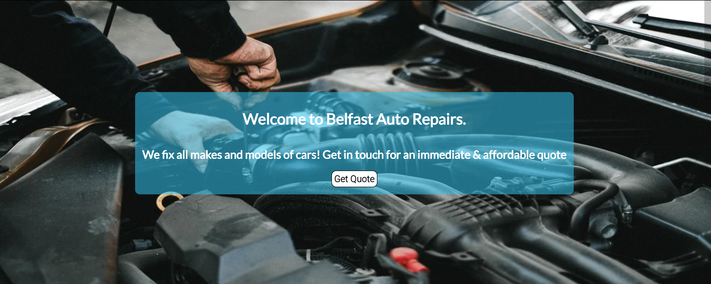

> Image with a box overlay with Call to action button. This button will take the user to the contact form on contact.html.

#### Services Section
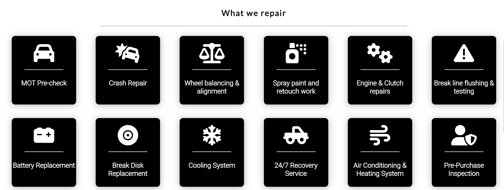

> Initially the design called for a services page but during development I changed the design to fit the scope of this project. In the future I would implement modals on all the service items to give typical faults, costs to repair and general timeframes.

#### Testimonials
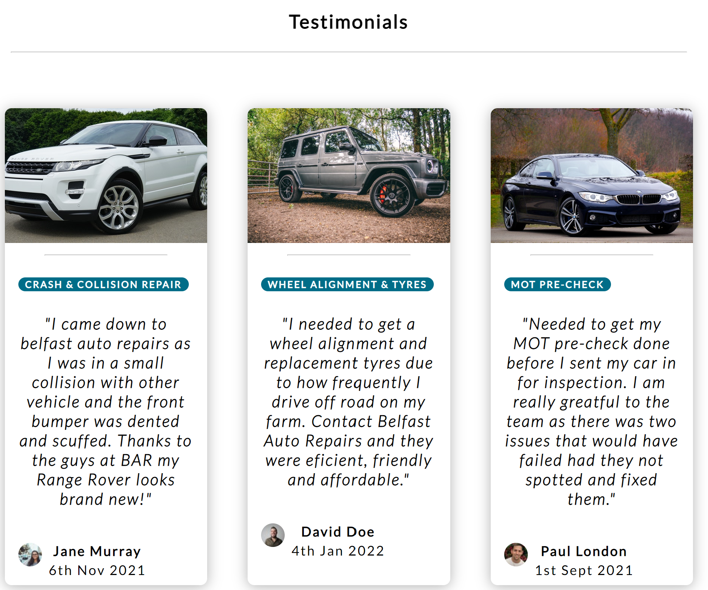

> General card idea was based around others I have seen and used on modern websites. I stared by making them from scratch anf then took a lot of inspiration from frontendmentor.com & freefrontend.com

#### Footer

> Flex footer used to showcase social media icons as well as physical address and opening times. I decided to include the opening times in a table as I felt it was aestetically pleasing compared to traditionally just the text content.

### about.html

#### About
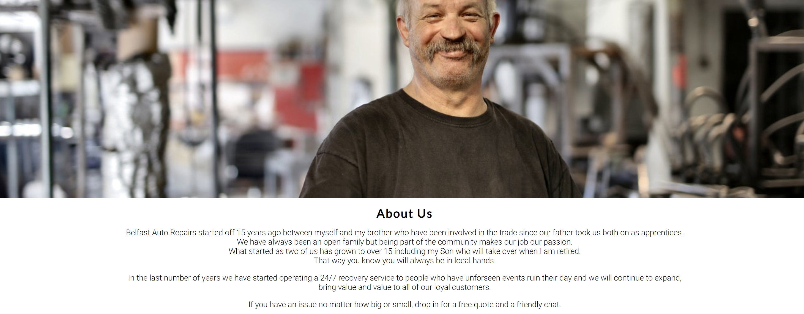

> The about section was initially intended to be a section about the garage history and then information about the bio of a few of the staff with image - text side by side. As the project progressed I decided to reduce this section for now.

### portfolio.html

#### Portfolio

> The portfolio section was originally intended to be a services page and possibly include some click to expand content, however as I included the services in the home page I felt it was more appropriate to add a portfolio of work being done and of completed work.

### contact.html

#### Contact Form
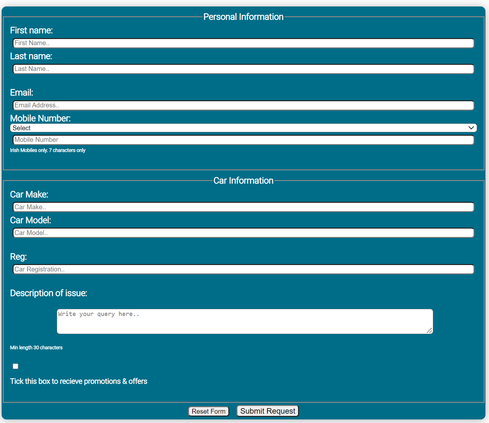

> Initially when I was creating the form element I used the blue color as a background as a placeholder while I was working. The original thought was that I would display a background image with the content of the form sitting on top. In hindsight it probably would have been a more visually appealing solution but I felt I had already overlay content in the hero section of index.html and wanted to try different approaches in this project. 

> I also think the color works with the minimalistic design of the site and it flows well into the contact numbers and map section.

> Please note that while the contact form does collect and pass the requested data as tested with the code institute form dump link, this form take the user to a created html page that gives them a form submission message. As Javascript was not part of the brief for this project it was not possible to make this a fully functioning form.

> This decision to forward to a new page was taken to improve user experience when using this project.

#### Map & Contact Numbers
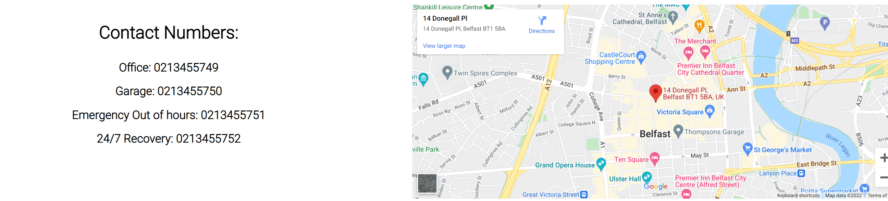

> Instead of using a map from my own google developer account I used an i-frame from maps.ie as it was a convenient and quick solution. 

# Features Left to implement

### Home page
> In the future I would like to include a side element banner to promote special offers that the repair shop may want to offer from time to time.

> I would like to add pop up modals to the services section to explain what the typical faults might be, costs to fix and estimated timeframes.

>I would also like to make the service tiles as modals that onClick they would pop open with information about average issues, cost and duration it would take to fix. 

>I would like to add a carousel section to the testimonial cards that would auto move in a rotational basis and consist of about 5-8 different testimonials.

### About Page
> In the future I would like to add profiles to the about page with a breakdown of all the staff at the business. Including their name, image, what they specialize in and brief bio about themselves.

### Portfolio
> I would like to add a lightbox type gallery for these photos so that when a user clicks on them it will pop up and allow them to scroll through them as their leisure.
> I would also like to add side by side before and after photos. Ideally with a scroll option for the user to see the work done.

### Contact Us
>I have not developed a back end for the contact form and this would be high on my priority list to ensure that e-mails with booking requests are being sent both to the business & confirmation to the customer of what they requested.

>I would like to add a WhatsApp option or similar style contact method for business to allow customers to message the business for a more real-time response, whether that be for 24/7 breakdown or general queries

>I would also like to add call from browser to save the user having to copy and paste the phone number.

### Additional Page ideas
>I would add a careers page for potential young adults who would be interested in apprentices to submit their info.

>I would add a facility for users to actually book in, in a realtime booking system.

# Technology Used
### Html
> Used to structure my webpages and the bones of any web project

### CSS
> Used to style and add layout to my project.

### Font Awesome
> Used for all the icons in this project

### GoogleFonts
> Used for all the fonts used in this project and to compare potential fonts.

### Googlemap API
> Used to embed I-frame on the contact page of a fictional business based in a real location in Belfast, Norther Ireland.

### Canva
> Used to create the favicon logo

### Online-Convert.com
> Used to convert files from png to webp to reduce size and improve web loading speed.

# Testing
> Testing on this project was mainly done manually by myself and a few friends to determine site usability, responsiveness and ensure it is intuitive to a completely new user.

### Testing Phase

**Testing for links and Form**
| Test |Outcome  |
|--|--|
|All links on Navigation lead to their correct pages| Pass  |
|Contact us button leads to contact form on contact us page| Pass
|Footer social links all lead to their respective social media sites |Pass|
|Contact form submits when all criteria is filled correctly| Pass  |
|User prevented from submitting form without correct elements| Pass|
|Form Validation presents when incorrect input type is entered |Pass|

**Testing for responsiveness**
| Test |Outcome  |
|--|--|
|Home page, about, portfolio, contact us displays correctly on screens larger than 950px|Pass |
|Home page, about, portfolio, contact us displays correctly on screens smaller than 950px |Pass  

### User testing

**User testing Challenge**

> 5 users are given some basic tasks prior to visiting web page and the results totaled to give result (20% per successful user result.)

| Test | Result |
|--|--|
|Upon arrival to website please navigate to where you would expect to find a contact form| 100%|
|Please navigate to the Facebook social of this business|100%  |
|Please fill in contact form with your information and preference in the marketing button| 100%|
|Please provide me with a contact number of 24/7 breakdown| 100%  |
|Please navigate to the Portfolio page and count how many images there are | 100%  |

**User responsive testing**

> 5 users were asked to view the website on their mobile devices and/or tablets to provide any feedback on errors or page overlapping issues.

| Test | Result |
|--|--|
|Issues Reported| None|

## Google Lighthouse Testing

### index.html

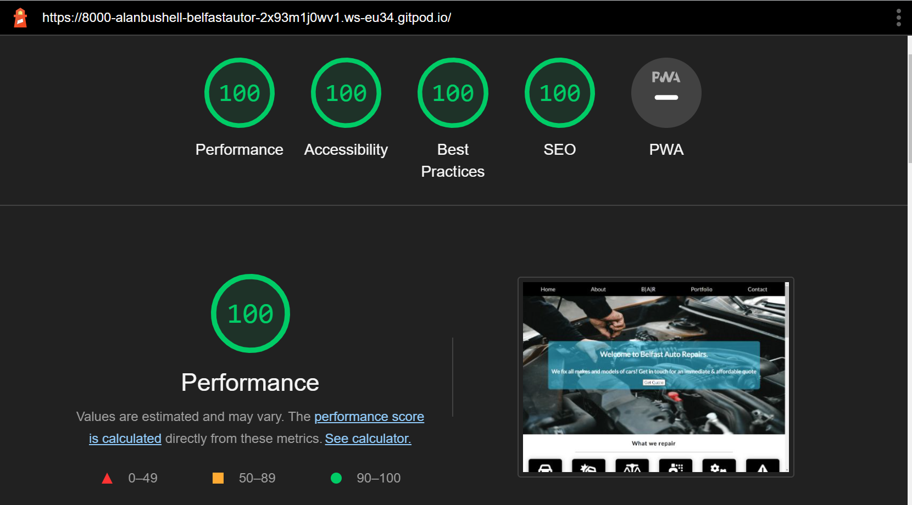

### about.html

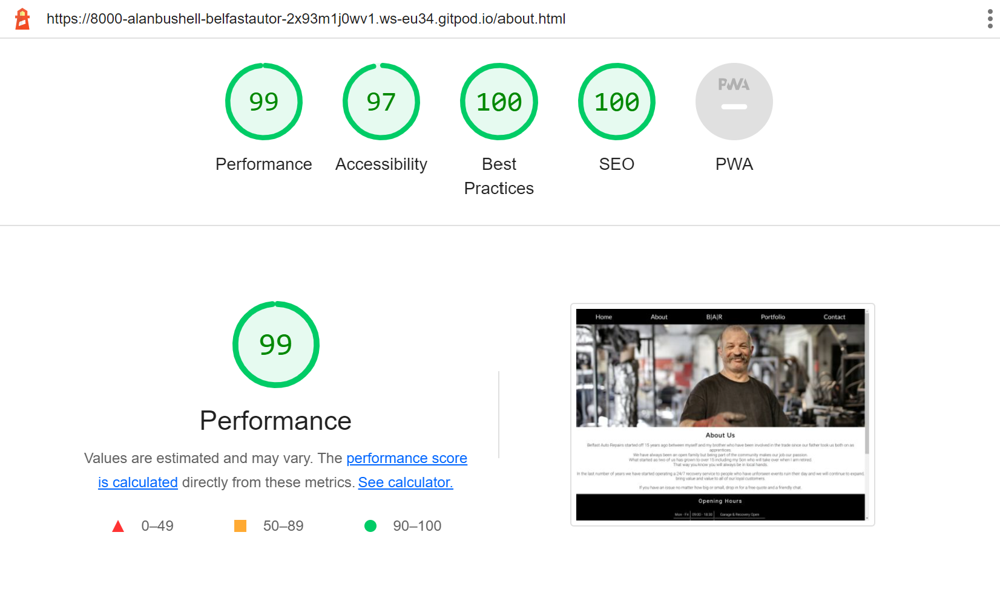

### portfolio.html

### contact.html

## HTML Validation

### index.html
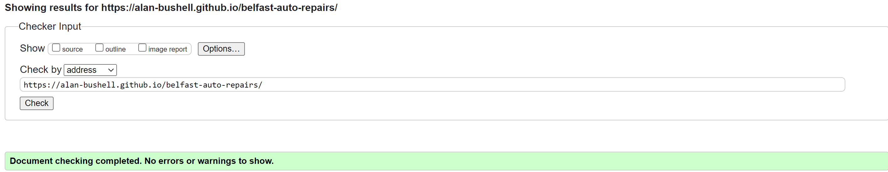
#### Result: No Errors

### about.html
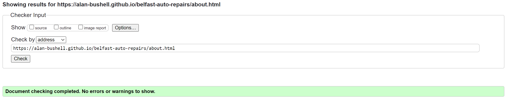
#### Result: No Errors

### portfolio.html
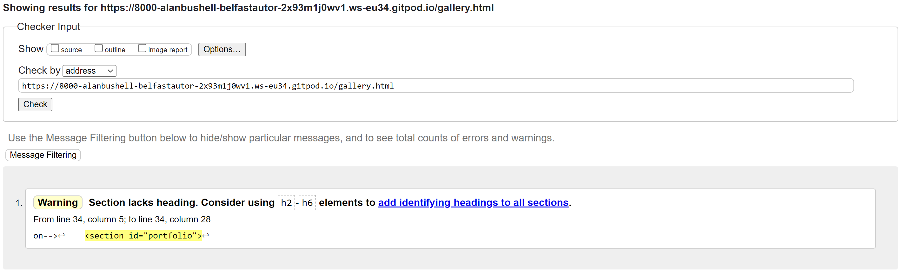
#### Result: No Errors, 1 warning about the section missing a heading. Page heading appears for the portfolio above and requires no additional content.

### contact.html
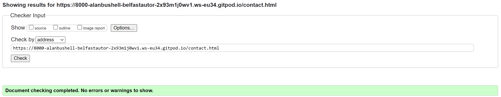
#### Result: No Errors

### contact-complete.html
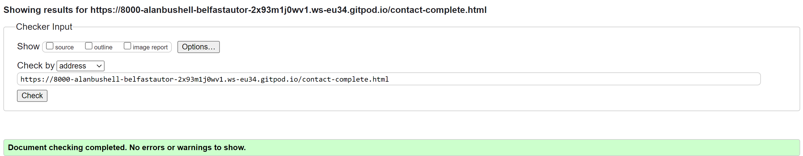
#### Result: No Errors

## CSS Validation

### contact-complete.html
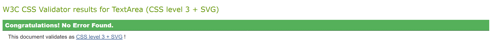
#### Result: No Errors

## **Bugs**
> Issues with centering content on the hero overlay. **fixed**

> Decided to improve the flow of the page that the parralax would be better between the two content sections. **fixed**

> Original image just didnt fit the flow of the page nor the style of the page **fixed**

> Font awesome social media icons showing as squares even though the script link is in the head and icon tags are correct. **fixed**

> Issue with footer content overlapping and not centering. **fixed**

> issue with services overlapping on mobile. (fixed, was targetting wrong element container) **fixed**

> Contrast issue noted on lighthouse for the tag elements on the testimonials.(fixed, made colour darker and increased font size and weight). **fixed**

> Images not in correct aspect ratio. (removed placeholder images and downloaded them in the size needed.) **fixed**

> Bug appeared which some images did not show when deployed. Issue resolved as some images were using absolute file paths and not relative. **fixed**

## Deployment

> To deploy the project I followed these steps starting from the main project repository [here](https://github.com/Alan-Bushell/belfast-auto-repairs).

 1. Clicked on `Settings` on the navigation menu in the repository
 2. I then selected the `Pages` menu on the side bar.
 3. In the first dropdown menu labeled `Source` I selected the branch of the name `main` from the dropdown.
 4. In the next dropdown labeled `/root` I left as the default option.
 5. Selected Save
 
> I then received a notification from GitHub that my project is being deployed and after about 1 minute & a couple of refreshes of the page it was ready and live.

## Credits

### All images sourced from pexels.com. Links for images included below

> hero: (https://www.pexels.com/photo/an-auto-mechanic-checking-the-engine-of-a-car-4315570/)

> parralax: Photo by jae park from Pexels(https://www.pexels.com/photo/set-of-tool-wrench-162553/)

> card1: Photo by Mike from Pexels(https://www.pexels.com/photo/white-land-rover-range-rover-suv-on-road-116675/)

> card1-user: Photo by Daniel Xavier from Pexels(https://www.pexels.com/photo/woman-wearing-black-eyeglasses-1239291/)

> card2: Photo by Lloyd Freeman from Pexels(https://www.pexels.com/photo/photo-of-mercedes-benz-g-class-parked-on-dirt-road-1429775/)

> card2-user: Photo by Andrea Piacquadio from Pexels(https://www.pexels.com/photo/man-in-brown-button-up-shirt-3785079/)

> card3: Photo by Mike from Pexels(https://www.pexels.com/photo/blue-bmw-coupe-892522/)

> card3-user: Photo by Nicholas Swatz from Pexels(https://www.pexels.com/photo/photo-of-man-wearing-white-shirt-2770600/)

> about-hero: Photo by Andrea Piacquadio from Pexels(https://www.pexels.com/photo/happy-elderly-worker-smiling-in-workshop-3846508/)

> port-image1: Photo by Andrea Piacquadio from Pexels(https://www.pexels.com/photo/man-in-black-jacket-standing-under-the-vehicle-3807133/)

> port-image2: Photo by Lex Ger from Pexels(https://www.pexels.com/photo/close-up-photo-of-automotive-part-3642618/)
 
> port-image3: Photo by Andrea Piacquadio from Pexels(https://www.pexels.com/photo/bearded-man-fixing-motorcycle-in-workshop-3822843/)
 
> port-image4: Photo by Andrea Piacquadio from Pexels(https://www.pexels.com/photo/man-in-black-jacket-and-black-pants-standing-under-vehicle-3807811/)
 
> port-image5: Photo by Mídia from Pexels(https://www.pexels.com/photo/red-car-engine-bay-4116220/?utm_content=attributionCopyText&utm_medium=referral&utm_source=pexels)
 
> port-image6: Photo by Malte Luk from Pexels(https://www.pexels.com/photo/man-fixing-vehicle-engine-2244746/)
 
> port-image7: Photo by Andrea Piacquadio from Pexels(https://www.pexels.com/photo/man-in-black-jacket-and-black-knit-cap-inspecting-car-engine-3807277/)
 
> port-image8: Photo by cottonbro from Pexels(https://www.pexels.com/photo/man-in-blue-dress-shirt-holding-brown-wooden-tool-4489737/)
 
> port-image9: Photo by Andrea Piacquadio from Pexels(https://www.pexels.com/photo/man-in-black-jacket-and-black-pants-sitting-near-silver-vehicle-3807386/)
 
> port-image10: Photo by Andrea Piacquadio from Pexels(https://www.pexels.com/photo/photo-of-man-inspecting-car-engine-3807517/)
 
> port-image11: Photo by cottonbro from Pexels(https://www.pexels.com/photo/man-in-black-t-shirt-and-blue-denim-jeans-standing-near-black-car-during-nighttime-4489721/)
 
> port-image12: Photo by cottonbro from Pexels(https://www.pexels.com/photo/person-in-black-shirt-and-gray-pants-standing-beside-black-car-4489765/)

## Content & Resources
### Maps.ie 
> Used to embed googlemap Iframe(https://www.maps.ie/)

### Pexels.com
> Images used in this project.

### w3 schools
> Used for general lookup for HTML and CSS synthax queries

### Stack Overflow
> Used to query issues relating to overlapping CSS issues

### freefrontend.com(https://freefrontend.com/css-cards/)
> Used for inspiration & reference for the cards deck used in testimonials

### csstricks.com
> Used for help with flex box and allignment

### Code Institute
> Project created in line with course content and within project 1 scope.

## Acknowledgements

### Dick Vlandeeren
> My mentor who provided me with constructive feedback and positive reinforcement where applicable.
